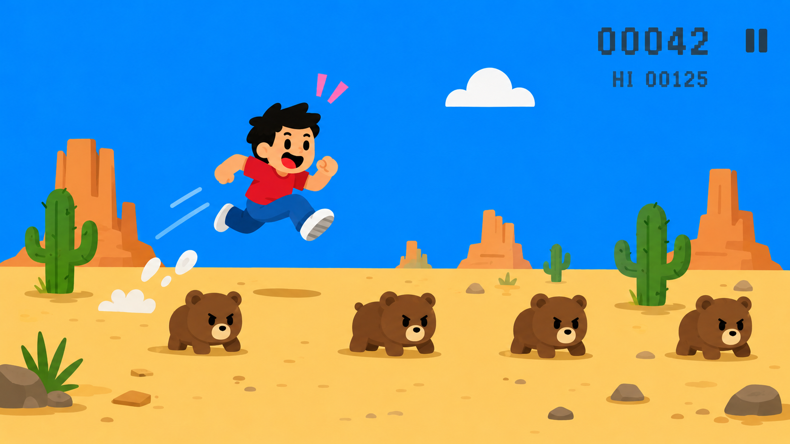

## What you will make

You're going to build a **Dino Jump** game: a game where a character jumps over obstacles and tries to survive for as long as possible. 

> [!NOPRINT]
>
> 

>  <iframe allowtransparency="true" width="485" height="402" src="https://scratch.mit.edu/projects/embed/1351632733/?autostart=false" frameborder="0"></iframe>
> 

> [!PRINTONLY]
>
> 

You'll set up a character, make it jump, add moving obstacles, and track a score. This example uses Giga, walking bears, and a desert backdrop, but your character, obstacles, and backdrop can look however you like!

### You will need:

- The Scratch editor
- A new Scratch project
