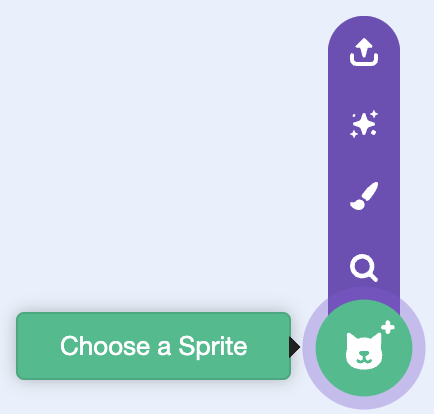

## Add the character and backdrop

Start a fresh Scratch project and add a character sprite and a backdrop.

> [!TASK]
>
> Open a [fresh Scratch project](https://scratch.mit.edu/projects/editor/){:target="_blank"} in a new tab. The project that opens with the Scratch cat is the right starting point.

> [!TASK]
>
> Delete the cat sprite.
>
> 

> [!TASK]
>
> Add any character with **Choose a Sprite**. This example uses `Giga Walking`, but your character can look however you like.
>
> 

> [!TASK]
>
> Add any backdrop with **Choose a Backdrop**. This example uses `Desert`, but choose a setting that suits your game.
>
> 

> [!TASK]
>
> Place the character near the bottom of the stage and make it face the right.
>
> {:width="100px" height="100px" style="object-fit: contain;"}
>
> ```blocks3
> +when green flag clicked
> +show
> +go to x: (-100) y: (-70)
> +point in direction (90)
> +set size to (100) %
> ```
>
> These values place the example character near the ground. Adjust the position and size if your character or backdrop is different.

> [!TIP]
>
> A **starting state** resets the game before play begins. Setting the character's position, direction, and size with the green flag makes every attempt begin the same way.

> [!TASK]
>
> Test your project. The character should appear in the same place each time you click the green flag.
