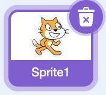
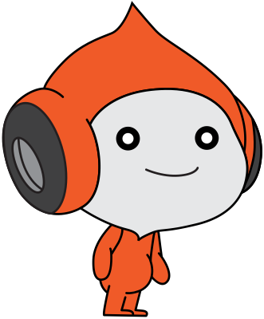
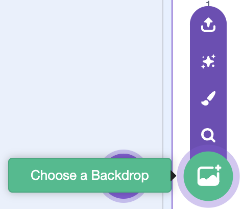
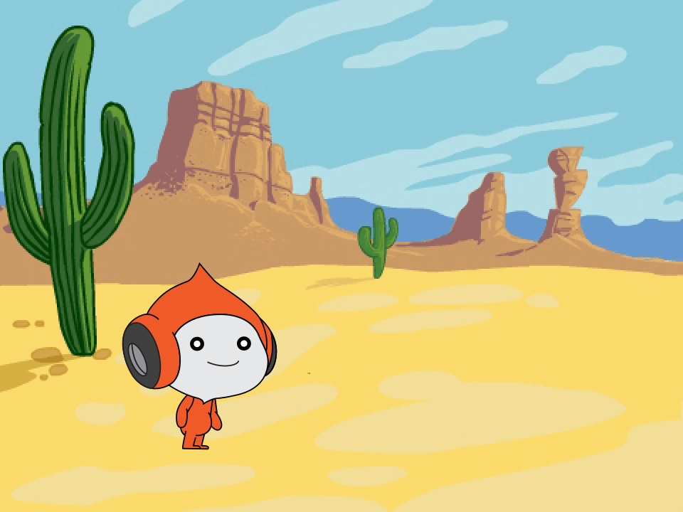

## Add the character and backdrop

Add your character and choose where your jumping game will take place.

> [!TASK]
>
> Open a [fresh Scratch project](https://scratch.mit.edu/projects/editor/){:target="_blank"} in a new tab. The project that opens with the Scratch cat is the right starting point.

> [!TASK]
>
> Delete the cat sprite, so that you start with an empty Stage.
>
> 

> [!TASK]
>
> Click **Choose a Sprite**.
>
> 
>
> Find `Pico`{:class="block3looks"} in the sprite library and click on it.
>
> 
>
> Pico appears on the Stage.

> [!TASK]
>
> Click **Choose a Backdrop**.
>
> 
>
> Find `Desert`{:class="block3looks"} in the backdrop library and click on it.
>
> Your Stage now shows Pico in the desert.
>
> 
>
> Pico might be in a different place on your Stage. You'll set its starting position next.

> [!TASK]
>
> Click on the `Pico`{:class="block3looks"} sprite, then click the **Code** tab.
>
> Add a script to place Pico near the bottom-left of the Stage.
>
> {:width="100px" height="100px" style="object-fit: contain;"}
>
> ```blocks3
> +when green flag clicked
> +go to x: (-100) y: (-70)
> ```

> [!TASK]
>
> **Test your project.** Click the green flag, drag Pico to a different place on the Stage, then click the green flag again.
>
> Pico goes back to its starting position.
