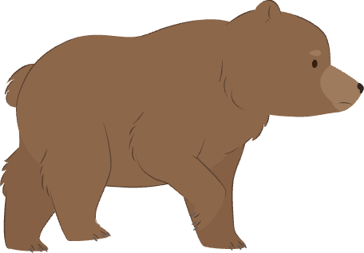

## Add obstacles

Use one hidden obstacle sprite to create clones that move across the Stage. Each clone will either hit the character or leave the Stage and add to the score.

> [!TASK]
>
> Choose any sprite to be an obstacle. This example uses `Bear-walking`, which has several costumes for a walking animation, but your obstacle can look however you like.

> [!TASK]
>
> Select your obstacle sprite. Open the **Sounds** tab, choose **Choose a Sound**, and add a collision sound. This example uses `Bite`, but you can choose any sound that fits your obstacle.
>
> 

> [!TASK]
>
> Create two variables for all sprites: `speed`{:class="block3variables"} and `score`{:class="block3variables"}. Show `score` on the Stage, but untick `speed` so players cannot see it.
>
> `speed` will control every obstacle clone, while `score` will count the obstacles the character avoids.

> [!TASK]
>
> Add this setup script to your obstacle sprite.
>
> {:width="100px" height="100px" style="object-fit: contain;"}
>
> ```blocks3
> +when green flag clicked
> +set rotation style [left-right v]
> +set [speed v] to (-5)
> +set [score v] to (0)
> +set size to (25) %
> +go to x: (280) y: (-85)
> +hide
> ```
>
> The negative `speed`{:class="block3variables"} will move obstacles to the left. The original obstacle starts just beyond the right edge and stays hidden because only its clones should appear.

> [!TASK]
>
> Extend the setup script so it creates obstacle clones at random intervals.
>
> {:width="100px" height="100px" style="object-fit: contain;"}
>
> ```blocks3
> when green flag clicked
> set rotation style [left-right v]
> set [speed v] to (-5)
> set [score v] to (0)
> set size to (25) %
> go to x: (280) y: (-85)
> hide
> +wait (1) seconds
> +forever
> +  create clone of (myself v)
> +  wait (pick random (0.8) to (2.4)) seconds
> +end
> ```
>
> The first obstacle waits for one second. After that, the random wait makes the gaps between obstacles unpredictable.

> [!TIP]
>
> Controlled **randomness** makes repeated attempts less predictable. Random wait times stop the player from memorising one fixed obstacle pattern.

> [!TASK]
>
> Start a second script that prepares each new clone.
>
> {:width="100px" height="100px" style="object-fit: contain;"}
>
> ```blocks3
> +when I start as a clone
> +show
> +point in direction (-90)
> ```
>
> Each clone appears at the original obstacle's position and faces left, ready to cross the Stage.

> [!TASK]
>
> Make the clone animate and move until it has passed the left side of the Stage.
>
> {:width="100px" height="100px" style="object-fit: contain;"}
>
> ```blocks3
> when I start as a clone
> show
> point in direction (-90)
> +repeat until <(x position) < (-200)>
> +  next costume
> +  change x by (speed)
> +end
> ```
>
> `next costume`{:class="block3looks"} animates an obstacle with multiple costumes. Each loop moves the clone left by the value stored in `speed`{:class="block3variables"}.

> [!TIP]
>
> **Visual feedback** helps players read what is moving. Changing costume while the clone moves makes the obstacle feel alive instead of sliding like a flat picture.

> [!TASK]
>
> Inside the `repeat until`{:class="block3control"} loop, check whether the obstacle is touching the character. Select your character's name from the `touching`{:class="block3sensing"} menu and your collision sound from the `start sound`{:class="block3sound"} menu. The example uses `Giga Walking` and `Bite`.
>
> {:width="100px" height="100px" style="object-fit: contain;"}
>
> ```blocks3
> when I start as a clone
> show
> point in direction (-90)
> repeat until <(x position) < (-200)>
>   next costume
>   change x by (speed)
> +  if <touching (Giga Walking v)?> then
> +    start sound (Bite v)
> +    hide
> +    stop [all v]
> +  end
> end
> ```
>
> The collision check runs after every movement. A collision plays the sound, hides the obstacle, and ends the game.

> [!TIP]
>
> **Collision detection** checks when game objects touch. The `touching (Giga Walking)?`{:class="block3sensing"} block turns contact with the obstacle into a lose condition.

> [!TASK]
>
> After the loop, award one point and remove the clone.
>
> {:width="100px" height="100px" style="object-fit: contain;"}
>
> ```blocks3
> when I start as a clone
> show
> point in direction (-90)
> repeat until <(x position) < (-200)>
>   next costume
>   change x by (speed)
>   if <touching (Giga Walking v)?> then
>     start sound (Bite v)
>     hide
>     stop [all v]
>   end
> end
> +change [score v] by (1)
> +delete this clone
> ```
>
> These blocks run only when the clone reaches the left edge without a collision, so the player earns one point. Deleting the off-screen clone prevents unused clones from building up.

> [!TIP]
>
> **Scoring** tells the player which action is valuable. Changing `score`{:class="block3variables"} by `1` only after a clone passes the left edge rewards dodging obstacles.

> [!TASK]
>
> Test your project. Obstacles should appear at different times, walk from right to left, increase the score when avoided, and stop the game when they touch the character.
