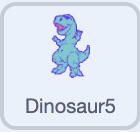

## Add obstacles

Create something for Pico to jump over.

> [!TASK]
>
> Click **Choose a Sprite**, then find `Dinosaur5`{:class="block3looks"} in the sprite library and click on it.
>
> 
>
> Dinosaur5 has several costumes, so it can animate as it moves.

> [!TASK]
>
> Click on the `Dinosaur5`{:class="block3looks"} sprite, then click the **Code** tab.
>
> Add a script to set its size and position.
>
> {:width="100px" height="100px" style="object-fit: contain;"}
>
> ```blocks3
> +when green flag clicked
> +set size to (25) %
> +go to x: (280) y: (-85)
> ```

> [!TASK]
>
> **Test your project.** Click the green flag.
>
> The obstacle shrinks and moves to the right edge of the Stage, ready to travel towards Pico.
